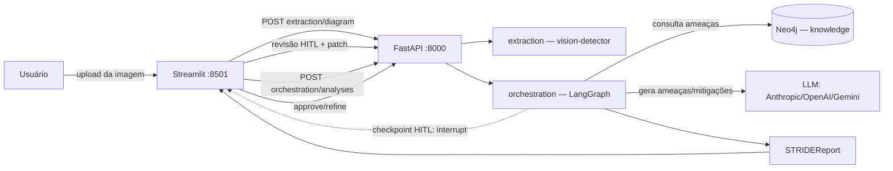

# posfiap_7iadt_techchallenge_fase5
Tech Challenge da Fase 5 (Hackaton): análise de arquitetura com IA e aplicando insights de segurança com modelo STRIDE

O **AI Centric STRIDE Analyzer** recebe uma imagem de diagrama de arquitetura
(ex.: AWS), extrai automaticamente seus componentes e fluxos de dados via
visão computacional, consulta uma base de conhecimento de ameaças STRIDE
organizada em grafo (Neo4j) e usa um LLM para gerar uma análise de segurança
completa — com um checkpoint humano (HITL) tanto na correção da extração
quanto no refinamento da análise antes do relatório final.

Todo o fluxo é acessível via uma interface Streamlit (upload → revisão da
extração → acompanhamento da análise → chat de refinamento → relatório com a
matriz STRIDE), consumindo uma API FastAPI que integra os três módulos do
sistema.

## Como executar

Pré-requisitos: Docker + Docker Compose, e uma chave de API de LLM
(Anthropic, OpenAI ou Gemini — qualquer uma serve).

```bash
git clone <url-do-repositorio>
cd posfiap_7iadt_techchallenge_fase5
cp .env.example .env               # preencher ao menos uma *_API_KEY e NEO4J_PASSWORD
docker compose up --build
docker compose exec api python -m knowledge.taxonomy_seed   # popula a taxonomia STRIDE no Neo4j
```

Acessar a interface em **http://localhost:8501**. A API fica em
`http://localhost:8000/api/v1`, com docs interativas em
`http://localhost:8000/docs`.

Sem chave de LLM configurada? O botão **"Usar Diagrama de Exemplo"** na tela
de upload permite demonstrar a extração e a revisão sem depender de uma
extração real — mas a análise STRIDE em si (`/orchestration/analyses`) chama
o LLM e precisa de uma chave válida.

Ver [`docs/development.md`](docs/development.md) para: subir só o Neo4j,
rodar a API fora do Docker, GPU para o vision-detector, e como rodar os
testes. Ver [`docs/api_reference.md`](docs/api_reference.md) para a
referência de endpoints.

## Arquitetura



## Responsabilidades por módulo

| Módulo | Dono | Descrição |
|---|---|---|
| [`extraction/`](extraction/README.md) + [`models/vision-detector/`](models/vision-detector/README.md) | Dev 1 | Extrai `ArchitectureDiagram` (componentes, fluxos, trust boundaries) de uma imagem via YOLOv8 |
| [`knowledge/`](knowledge/README.md) | Dev 2 | Base de conhecimento STRIDE em grafo (Neo4j): taxonomia, ingestão, consultas por tipo de elemento/serviço cloud |
| [`orchestration/`](orchestration/README.md) | Dev 3 | Grafo LangGraph que itera por componente, consulta o KG, gera ameaças via LLM e gerencia o checkpoint HITL até o relatório final |
| `app/`, `streamlit_app/`, infraestrutura Docker | Dev 4 | Camada de integração: app FastAPI que monta os três routers, interface Streamlit completa, Docker Compose, logging, testes E2E |

## Limitações conhecidas do MVP

- **Estado em memória:** o `MemorySaver` do LangGraph guarda as sessões de
  análise na memória do processo da API — reiniciar o container `api`
  durante uma análise em andamento perde a sessão (não há persistência em
  disco/Redis neste MVP).
- **Refinamento HITL não é direcionado:** o feedback de refinamento se aplica
  a todos os componentes analisados, não a um componente específico.
- **`st.session_state` do Streamlit** persiste só durante a sessão do
  navegador — recarregar a página fora do fluxo normal de navegação perde o
  progresso da análise em andamento (thread_id, diagrama corrigido).
- **Sem fila/streaming de progresso:** `POST /orchestration/analyses` roda
  de forma síncrona até o checkpoint HITL (chamadas LLM sequenciais, uma por
  componente) — para diagramas com muitos componentes a chamada pode levar
  alguns minutos; não há barra de progresso incremental via polling.

## Testes

```bash
pytest                # suíte completa (sem Neo4j real) -- inclui tests/test_e2e.py
pytest -m integration # testes que dependem de Neo4j real de pé
```

Ver [`docs/development.md`](docs/development.md#rodar-os-testes) para
detalhes (inclusive os testes do `vision-detector`, que rodam dentro do
próprio container).

## Extração de diagrama (`POST /api/v1/extraction/diagram`)

A extração de um `ArchitectureDiagram` a partir de uma imagem é feita pelo
detector de visão computacional em [`models/vision-detector`](models/vision-detector/README.md)
(YOLOv8), orquestrado pelo contrato de dados em [`extraction/`](extraction/README.md).
Ver [`docs/development.md`](docs/development.md#extração-de-diagrama-vision-detector)
para como subir, configurar GPU ou importar o modelo direto sem Docker.

Os pesos treinados ficam publicados no Hugging Face Hub
([luisasousa/aws-architecture-vision-detector](https://huggingface.co/luisasousa/aws-architecture-vision-detector))
e são baixados automaticamente pelo container `vision-detector` no primeiro
`docker compose up` — não é preciso treinar o modelo do zero para usar a API.
Quem preferir treinar seu próprio modelo localmente também pode — precisa do
dataset de treino, ver [`docs/development.md`](docs/development.md#pesos-do-modelo-usar-o-pré-treinado-ou-treinar-localmente).
