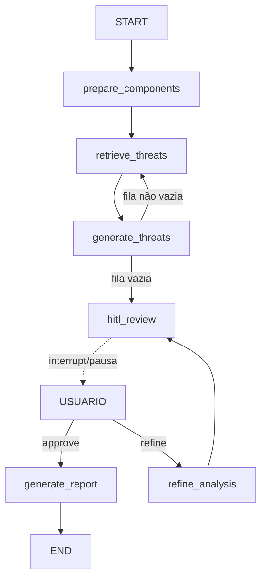

# `orchestration/` — Orquestração da análise STRIDE (Dev 3)

Grafo LangGraph que conecta a extração do diagrama (Dev 1) à base de
conhecimento STRIDE (Dev 2), itera por componente, gera ameaças/mitigações via
LLM, oferece checkpoint HITL (`interrupt()`) e produz o relatório final.

> **Estado atual: Épicos 1–4 concluídos.** Retrieval (com fallback), geração via
> LLM, HITL real e API estão implementados e testados. Os módulos reais de Dev 1
> (`extraction`) e Dev 2 (`knowledge`) ainda são stubs de contrato — a troca é
> indolor se os campos baterem (ver `docs/contrato-integracao.md`).

## Topologia



## Ciclo de vida

1. **prepare_components** — ordena `components_queue` por `element_type`
   (`process → data_store → data_flow → external_entity`) e zera os acumuladores.
2. **retrieve_threats** — desenfileira o próximo componente e consulta o KG.
   Cascata de fallback: `knowledge.query.get_stride_threats()` (real) →
   `knowledge.fixtures.get_fixture_for()` (fixture) → `KGQueryResult` vazio
   (`ElementTypeNotFoundError`, nunca aborta).
3. **generate_threats** — gera as ameaças STRIDE via LLM (structured output).
   Retry de rede (interno ao cliente, 3×) + retry de validação (2×, reinjeta o
   erro no prompt). Fallback: `stride_entries=[]` + marca `failed_component_ids`.
4. **check_iteration** (aresta condicional) — volta a `retrieve_threats` se a
   fila não está vazia; senão segue a `hitl_review`.
5. **hitl_review** — `interrupt()`: **pausa** o grafo e devolve um resumo ao
   usuário. Retomada via `Command(resume={"action": ...})`.
6. **route_after_hitl** (aresta condicional) — `generate_report` se aprovado;
   senão `refine_analysis`.
7. **refine_analysis** — refina cada análise via LLM (`REFINEMENT_*`) com base no
   feedback e volta ao `hitl_review` (nova pausa). Em falha, mantém a análise atual.
8. **generate_report** — consolida o `STRIDEReport` (matriz STRIDE + resumo de risco).

## Pontos de entrada

### Serviço (recomendado — usado pelo router)

```python
from orchestration import run_analysis, send_hitl_message, get_analysis_state

state = run_analysis(diagram)                              # -> GraphStateResponse (hitl_pending)
state = get_analysis_state(state.thread_id)                # polling
state = send_hitl_message(state.thread_id, "approve")      # -> completed (com report)
# ou: send_hitl_message(tid, "refine", feedback="...")     # -> pausa de novo
```

### Router FastAPI (montado pelo Dev 4)

```python
from orchestration.router import router
app.include_router(router, prefix="/api")
```

Rotas: `GET /health`, `POST /analyses`, `GET /analyses/{id}`,
`POST /analyses/{id}/messages`, `GET /analyses/{id}/report`.

### Grafo direto (baixo nível)

```python
from orchestration.graph import build_graph
from langgraph.types import Command

graph = build_graph()
cfg = {"configurable": {"thread_id": "abc"}, "recursion_limit": 100}
graph.invoke({"diagram": diagram}, cfg)                    # pausa no hitl_review
final = graph.invoke(Command(resume={"action": "approve"}), cfg)
report = final["report"]                                   # STRIDEReport
```

## Configuração (LLM)

Via `os.environ` (nenhuma chave hardcodada; use `.env` a partir de `.env.example`).

- `ANALYSIS_LLM_PROVIDER` — `anthropic` | `openai` | `gemini`
- Chaves: `ANTHROPIC_API_KEY` | `OPENAI_API_KEY` | `GEMINI_API_KEY`
- `ANALYSIS_LLM_TIMEOUT_S` (90), `ANALYSIS_MAX_TOKENS` (4096)
- Modelos: `ANALYSIS_ANTHROPIC_MODEL`, `ANALYSIS_OPENAI_MODEL`, `ANALYSIS_GEMINI_MODEL`
  (default do Gemini: `gemini-flash-latest`; `gemini-2.5-flash` foi descontinuado
  para novos usuários)
- `ANALYSIS_GEMINI_REASONING_EFFORT` (opcional/opt-in; vazio = não envia. "none"
  desliga o thinking no 2.5-flash mas causa 400 no gemini-3.x)
- `ANALYSIS_LLM_MIN_INTERVAL_S` (0 = sem pacing; ~6 no free tier do Gemini para
  evitar 429 nas ~14 chamadas sequenciais de uma análise)

**Gemini** é integrado via o **endpoint OpenAI-compatível do Google** (reusa o
cliente `openai` já pinado — sem nova dependência, mantém `pydantic==2.9.2`).

Em testes, mocke `LLMAnalysisClient.analyze` (ou o SDK). Valide a conexão real
com `python scripts/smoke_llm.py` (uma chamada, custo mínimo).

## Notas de integração (para Dev 4)

- **Execução síncrona:** `run_analysis` roda até a pausa HITL. Para "responder na
  hora + polling", envolva em `BackgroundTasks` e use `GET /analyses/{id}`.
- **`recursion_limit`** é dimensionado automaticamente pelo `service`
  (~`2N+20`); ao invocar o grafo direto, passe um limite folgado.
- **`thread_id`** identifica a sessão (checkpointer `MemorySaver`).
- **Canais `None`:** o LangGraph não materializa canais com valor `None` — leia o
  estado com `.get()` (o `service` já faz isso ao montar o `GraphStateResponse`).
- **Contrato de saída:** `models.py` (`STRIDEReport`, `GraphStateResponse`) +
  `schemas_v1.json` (snapshot com teste anti-drift).

## Limitações do MVP

- `MemorySaver` em memória: sessões HITL perdidas em restart do servidor
  (`AsyncSqliteSaver`/`RedisSaver` como melhoria futura).
- `extraction`/`knowledge` reais pendentes de Dev 1/Dev 2 (hoje stubs + fixtures).
- Refinamento HITL aplica o feedback a todos os componentes (direcionado a um
  componente específico é melhoria futura).

## Documentação relacionada

- `docs/contrato-integracao.md` — contrato campo a campo com Dev 1/Dev 2.
- `docs/epico-{1,2,3,4}-entregaveis.md` — entregáveis por épico.
- `docs/revisao-epico-{1,2,3,4}.md` — revisões arquiteturais.
